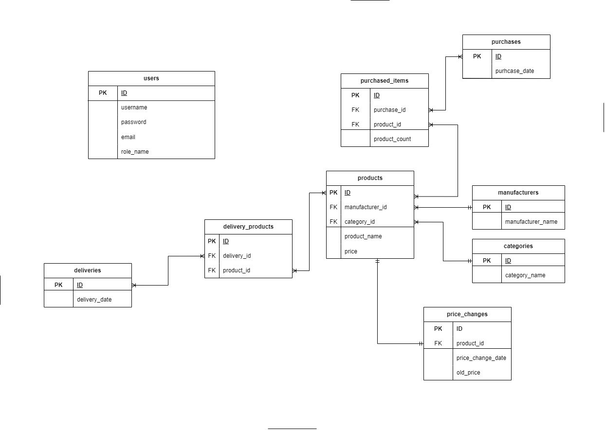

# spring-eshop
Spring-Eshop repository is a study full-stack e-commerce application built using:
### Back-End
<ul>
<li>REST API</li>
<li>Spring</li>
<li>Spring Security </li> 
<li>Spring Boot</li>
<li>Spring MVC</li>
<li>Hibernate</li>
<li>PostgreSQL</li>
<li>Flyway for data migration</li>
</ul>

### Front-End
<ul>
<li>JavaScript</li>
<li>CSS</li>
<li>ThymeLeaf</li>
<li>HTML</li>
</ul>

## DB model

